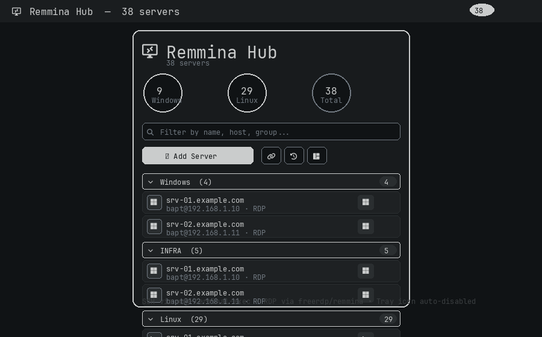

# Remmina Hub

An [Omarchy](https://omarchy.org) plugin for the Quattro bar — manage **RDP, SSH, VNC & SPICE** remotes in one place. Import from CSV/TXT, from your existing `~/.ssh/config` and `~/.local/share/remmina/*.remmina`, group & filter, launch with the right tool, and keep the broken Remmina tray icon disabled.



## Features

- **Unified hub** — RDP, SSH, VNC, SPICE (and SFTP/HTTP) in a single panel. No passwords stored.
- **Groups + collapsible sections** — e.g. `Windows`, `Linux`, `INFRA`, `Prod`. Each section collapses/expands; `Expand`/`Collapse` all.
- **Counters** — circular gauges: Windows (RDP), Linux (SSH/VNC/SPICE), Total.
- **Search filter** — live filter on name / host / protocol / group / username / notes.
- **Add / Edit / Delete** — `＋ Add Server` form (name*, host*, protocol, port, username, group, notes) + per-row edit/delete with confirmation.
- **Launch stacked right** — SSH → terminal, RDP → freerdp/remmina, VNC, SPICE. Uses `xdg-terminal-exec` for SSH so your Omarchy default terminal (Alacritty / Foot / Ghostty / Kitty) is honored.
- **Import**
  - **CSV** — header `name,host,protocol,port,username,group,notes` (e.g. `srv01,host.example.com,RDP,3389,admin,Windows,prod`). Via `zenity` file picker.
  - **TXT** — one per line `name;host;protocol;port;username;group` (`;` `,` `|` or tab).
  - **SSH config** — `Import ~/.ssh/config` parses `Host`/`HostName`/`User`/`Port` (wildcards ignored). Pre-filled group `Linux`.
  - **Remmina** — `Import Remmina files` reads `~/.local/share/remmina/*.remmina` (`name`, `server`, `protocol`, `username`, `group`).
  - Imports are idempotent by `(name, host)` — re-importing skips duplicates.
- **Remmina tray icon disabled** — explicit user action via **Fix** button (creates timestamped backup `remmina.pref.bak.*`, verifies no symlink/regular file/owner, `0600` atomic replace via `mkstemp` + `fsync`, rollback via `--rollback`). The tray breaks on Hyprland, so the check is offered on panel open, not auto-applied.
- **Storage** — `~/.config/remmina-panel/` (`0700`) + `servers.json`/`groups.json`/`cert-exceptions.json` (`0600`, `mkstemp` in same dir + `fsync` + `flock` + atomic `replace` + dir `fsync`). No secrets in repo.

## Installation

```bash
omarchy plugin add https://github.com/tug-benson/omarchy-remmina --enable
```

Or symlink during development:

```bash
ln -s /path/to/omarchy-remmina ~/.config/omarchy/plugins/io.github.tug-benson.remmina
omarchy-shell shell rescanPlugins
```

To remove:

```bash
omarchy plugin remove io.github.tug-benson.remmina
```

## Dependencies

All **manual** via `pacman` / `yay` — no `snap`, no auto-install:

```bash
omarchy pkg add remmina python3 zenity  # required
# per-protocol (manual, install only what you use):
omarchy pkg add freerdp        # optimal RDP (xfreerdp / xfreerdp3) — cert validation strict by default
omarchy pkg add virt-viewer    # SPICE + VNC via remote-viewer
omarchy pkg add openssh        # SSH
```

- `remmina` — fallback for RDP/VNC/SPICE URI launch (`remmina -c <uri>`) — **manual**
- `freerdp` — preferred for RDP (`xfreerdp /v:host:port /u:user`) — **manual**, cert validation enforced
- `virt-viewer` (`remote-viewer`) — preferred for SPICE/VNC — **manual**
- `python3` — JSON store, CSV/TXT/SSH/Remmina import, launch helpers — **required**
- `zenity` — file picker for CSV/TXT/JSON import — **manual**
- `xdg-terminal-exec` (comes with Omarchy) — launches SSH in your default terminal.

## Usage

1. Click the Remmina Hub icon in the bar to open the hub.
2. Use the search field to filter.
3. `＋ Add Server` — fill `Name`, `Host` (IP or FQDN), `Protocol`, `Port`, `Username`, `Group`, then Add.
4. Click the connect button on a row to connect:
   - **SSH** → `xdg-terminal-exec -- ssh [user@]host [-p port]` (uses your SSH config / keys; configure `~/.ssh/config` first).
   - **RDP** → strict cert validation by default; `xfreerdp /v:host:port /u:user /d:domain +clipboard /dynamic-resolution` if `freerdp` present, otherwise `remmina -c rdp://user@host:port` or temporary `*.remmina` (`cert_ignore=0`, `0700` runtime, `atexit` cleanup). For self-signed/host-pinned certs, explicitly allow per-host via `omarchy-remmina-servers cert-allow <host>` or `omarchy-remmina-launch --allow-cert <host>` (narrow TOFU, stored in `cert-exceptions.json` 0600, checked before adding `/cert:ignore` or `cert_ignore=1`).
   - **VNC** → `remmina -c vnc://host:port` (or `vncviewer`/`virt-viewer`).
   - **SPICE** → `remote-viewer spice://host:port` or `remmina -c spice://...`.
5. Use the import buttons:
   - **CSV/TXT** — file picker
   - **Remmina** — import all `~/.local/share/remmina/*.remmina`
   - **SSH** — import `~/.ssh/config`
6. Toggle groups collapsed/expanded via the header chevron or the `Expand`/`Collapse` links.

### CSV example (`servers.csv`)

```csv
name,host,protocol,port,username,group,notes
srv-win-01,host.example.com,RDP,3389,admin,Windows,prod
srv-lab-01,lab.example.com,SSH,22,admin,Linux,lab
vnc-workstation,example.com,VNC,5900,,Linux,
```

### TXT example (`servers.txt`)

```
srv01;host.example.com;RDP;3389;admin;Windows
srv02;lab.example.com;SSH;22;admin;Linux
```

## Prerequisites & SSH notes

- **SSH** does not use Remmina — it invokes your shell's `ssh`. Ensure `~/.ssh/config` is set up with `Host`, `User`, `IdentityFile`, etc. The plugin can import that file to pre-populate the list, but it never reads private keys.
- **Sensitive metadata collected on import (explicit user action only)**:
  - **SSH** `~/.ssh/config` (via **Import SSH** button): collects `Host` (as `name`), `HostName` (as `host`), `User` (as `username`), `Port` — stored as `host`/`username`/`port` in `servers.json`. This is infrastructure metadata (hostnames/usernames) — local only, `0600`, never auto-imported.
  - **Remmina** `~/.local/share/remmina/*.remmina` (via **Import Remmina** button): collects `name`, `server` (host:port), `protocol`, `username`, `domain`, `group` — stored as `name`/`host`/`protocol`/`username`/`domain`/`group`. This is infrastructure metadata — local only, respects `0600` and symlink/owner checks, not auto-imported.
  - **CSV/TXT/JSON** (via file picker): collects `name,host,protocol,port,username,domain,group,notes` from the selected file (max 2 MiB, 10k lines, 1k records, 256-char fields).
- **RDP/VNC/SPICE** — no credentials stored; authentication happens in `freerdp`/`remmina`/`remote-viewer` dialogs.
- **RDP cert handling** — strict by default (`cert_ignore=0`, no `/cert:ignore`). Use `cert-allow` for per-host TOFU/pinned exception (`~/.config/remmina-panel/cert-exceptions.json` 0600, narrow exact-host match).
- **Tray icon** — **explicit** `Fix`/`Check` buttons in panel (not auto). `omarchy-remmina-tray-fix --fix` creates backup, verifies parent `0700` no-symlink/type/owner, size ≤1 MiB, `mkstemp` `0600` + `fsync` + atomic `mv` + dir `fsync`, rollback via `--rollback`. Manual: `~/.config/omarchy/plugins/io.github.tug-benson.remmina/bin/omarchy-remmina-tray-fix --check|--fix|--rollback`.

## Layout

```
omarchy-remmina/
├── manifest.json
├── BarWidget.qml          # bar icon + badge + panel loader
├── Panel.qml              # counters, search, groups, rows, add/edit form, import, confirm
├── Service.qml            # state: servers, filter, groups, CRUD, launch, import, tray fix
├── preview.png
├── LICENSE
├── README.md
└── bin/
    ├── omarchy-remmina-servers    # CRUD + stats (python)
    ├── omarchy-remmina-launch     # protocol-aware launch (python)
    ├── omarchy-remmina-import     # CSV/TXT/SSH/Remmina import (python)
    └── omarchy-remmina-tray-fix   # disable Remmina tray icon (bash)
```

## Security & privacy

- No passwords or private keys are ever written to disk by this plugin. Only `name`, `host`, `protocol`, `port`, `username`, `domain`, `group`, `notes` are stored in `~/.config/remmina-panel/servers.json` (`0600`, parent `0700`, `flock` + `mkstemp` same-dir `0600` + `fsync` + atomic `replace` + dir `fsync`). `groups.json`/`cert-exceptions.json` same hardening.
- No network calls — all data stays local.
- No personal data is committed to the public repo (see `.gitignore`).
- All `Process` invocations use `python3` vector args or `bash -lc` with single-quoted JSON via env var — no shell injection from server fields. **Hardened:** hard deadlines (8s list/groups, 10s CRUD/launch, 30s import, 60s zenity), producer-side limits (stdin 64 KiB, file 2 MiB, 10k lines, 1k records, 256-char fields, 2k servers, 500 groups, output 256 KiB/8 KiB), process-group cleanup via `running=false` + `Timer`.
- Temporary Remmina profiles use private runtime `$XDG_RUNTIME_DIR/omarchy-remmina` (`0700`, `0600` files, `atexit` + 1h delayed cleanup, old-tmp purge).
- Imports (CSV/TXT/JSON/SSH/Remmina/stdin) enforce file-byte, line, record, field, collection limits as above; Remmina source files verified no-symlink/regular file/owner/size.
- State writes verify private parents, no-symlink, owner, `flock`, exclusive `mkstemp`, `fsync` file+dir, atomic replace.

## Acknowledgements

Inspired by [j0achim/omarchy-bolt](https://github.com/j0achim/omarchy-bolt).

## License

MIT
